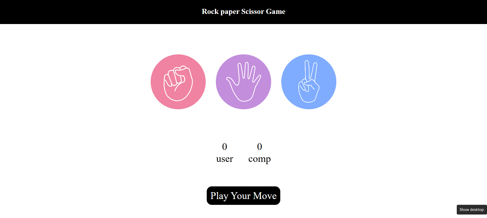

# 🪨📄✂ Rock-Paper-Scissors Game


A simple and fun **Rock-Paper-Scissors** game built using **HTML, CSS, and JavaScript**.  
Play against the computer and see if you can win! 🎮

---

## 🚀 Features
- 🎯 **Interactive Gameplay** – Play against the computer with instant results.
- 🎨 **Beautiful UI** – Simple and clean design using HTML & CSS.
- 🔄 **Dynamic Score Update** – Tracks your wins, losses, and draws.
- 📱 **Responsive Design** – Works on desktop and mobile.

---

## 📷 Demo
  
*(Replace `screenshot.png` with a screenshot of your game)*

---

## 🛠 Tech Stack
- **HTML** – Structure of the game
- **CSS** – Styling and animations
- **JavaScript** – Game logic and interactions

---

## 🎮 How to Play
1. Select **Rock**, **Paper**, or **Scissors**.
2. The computer will make its choice.
3. The winner is decided based on:
   - Rock 🪨 beats Scissors ✂
   - Scissors ✂ beats Paper 📄
   - Paper 📄 beats Rock 🪨
4. Keep playing to improve your score!

---

## 📂 Project Setup
To run this game locally:
```bash
# Clone the repository
git clone https://github.com/Suchit_kumar_45/Rock_Paper_scissors_game.git

# Open the index.html file in your browser
